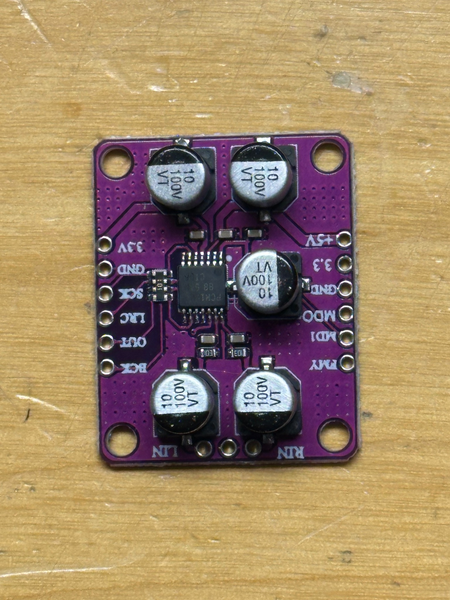
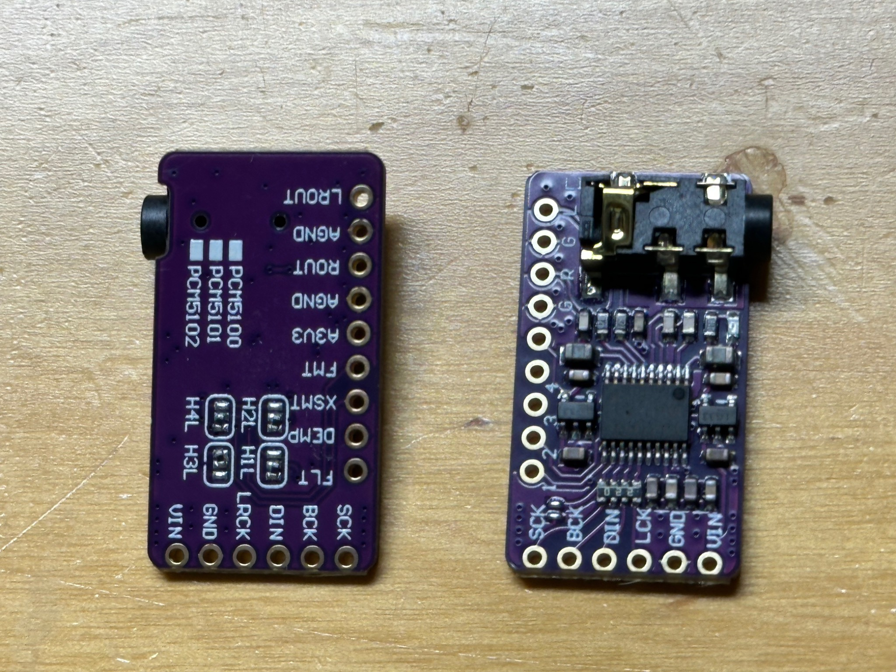
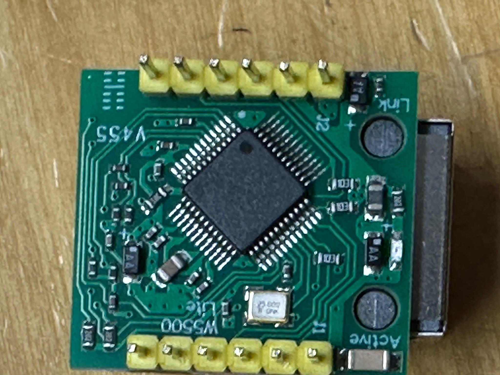
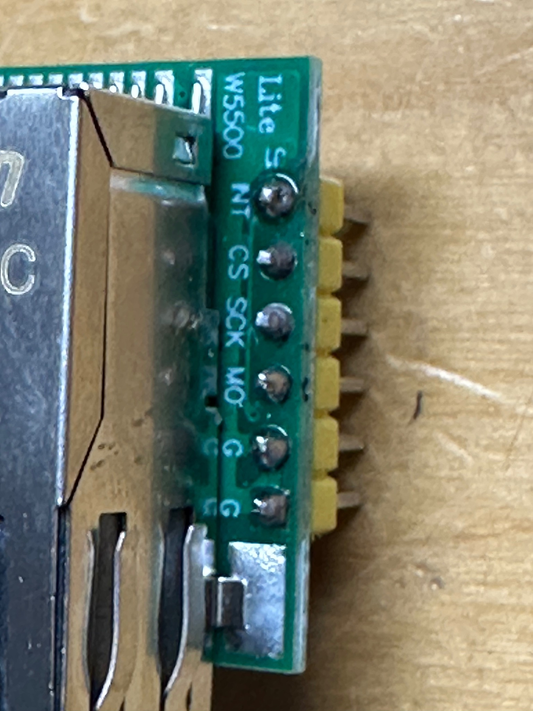
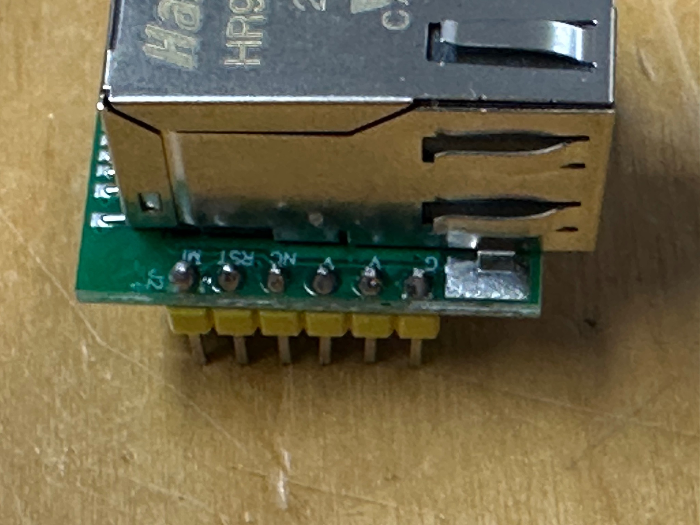
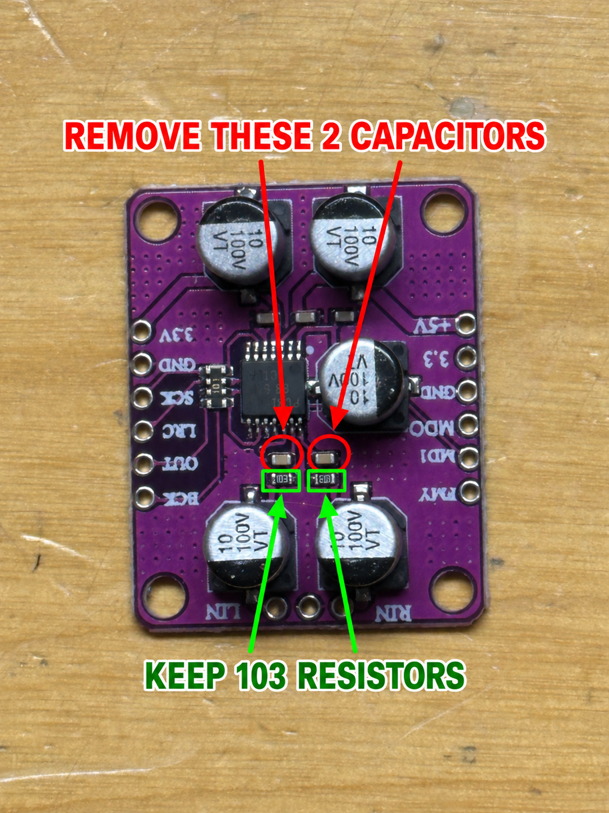

# Hardware, board photographs and wiring

This project uses a **Raspberry Pi Pico 2 (RP2350)** at 144 MHz, one
**PCM1808 stereo ADC breakout**, **four PCM5102-family stereo DAC breakouts**
(PCM5102A in the reference wiring), and a **W5500 SPI Ethernet module** for
receiver control. A Pico 2 W is also supported by the build, with Wi-Fi
unused. The photographs below were supplied with the hardware development;
the precise PCB revisions in your hands may differ. No Pico 2 board photo
was supplied, so use the printed **GP** labels on your Pico 2 and the table
below for that board.

The audio path is analog stereo input → PCM1808 → Pico 2 DSP → four separate
stereo DACs. W5500 carries only Onkyo/eISCP control commands over Ethernet;
there is no Ethernet, Wi-Fi or USB audio in this firmware. All five audio
converters share **96 kHz LRCK and 64× BCLK** generated by PIO; PCM1808 also
receives **256× MCLK**.

## Converter connections

| Module terminal / signal | Pico 2 pin label | Direction at Pico | Notes |
| --- | --- | --- | --- |
| PCM1808 `LRC` / LRCK | **GP10** | Output | Common stereo frame clock to ADC and all DACs. |
| PCM1808 `BCK` / BCLK | **GP12** | Output | Common bit clock to ADC and all DACs. |
| PCM1808 `OUT` / DOUT | **GP27** | Input | ADC serial data to Pico. |
| PCM1808 `SCK` / MCLK | **GP28** | Output | ADC master clock. Do not confuse with W5500 SPI `SCK`. |
| DAC 0 `DIN` | **GP11** | Output | LOW stereo band. |
| DAC 1 `DIN` | **GP13** | Output | LOW_MID stereo band. |
| DAC 2 `DIN` | **GP14** | Output | HIGH_MID stereo band. |
| DAC 3 `DIN` | **GP15** | Output | HIGH stereo band. |
| Every DAC `LRCK` and `BCK` | **GP10**, **GP12** | Output | One LRCK/BCLK pair distributed to all four DAC boards. |
| ADC, DAC and W5500 `GND` / `G` | Pico **GND** | Common | Join grounds; provide suitable power to **each module**. |

The pictured ADC labels its supplies `+5V`, `3.3` and `GND`. The pictured DAC
modules label their supply `VIN` and sometimes `3V3`, with `GND`/`AGND`.
Power according to the **specific breakout's schematic**; these labels do
not prove that the module's `VIN` pin accepts the same voltage as another
board. Check PCM1808 format/mode straps and each DAC's `SCK`/format straps
on its actual PCB. This firmware drives PCM1808 MCLK and I²S LRCK/BCLK;
it does **not** supply a DAC SCK/MCLK connection. A DAC board must be
configured to work from LRCK/BCLK without an external DAC SCK, as on the
tested board variant. Do not join DAC `SCK` blindly to the ADC MCLK.

*PCM1808 module supplied for this project. Its header shows `SCK`, `LRC`,
`OUT`, `BCK`, and supply and format labels; analog `LIN`/`RIN` are on the
lower edge. The photograph is rotated relative to some schematics.*

*Two supplied DAC breakout variants. The left board is marked for the
PCM5100/PCM5101/PCM5102 family; the header labels on both include `DIN`,
`BCK` and `LRCK`. Check the actual chip and board strap settings before
assuming these different breakout layouts are interchangeable.*

## W5500 control connection

| W5500 terminal | Pico 2 pin label | SPI0 function |
| --- | --- | --- |
| `MI` / MISO | **GP0** | Data from W5500 to Pico |
| `CS` | **GP1** | Chip select |
| `SCK` | **GP2** | SPI clock, separate from ADC MCLK |
| `MO` / MOSI | **GP3** | Data from Pico to W5500 |
| `RST` | **GP4** | W5500 reset |
| `INT` | **GP5** | Input with pull-up; firmware polls control state |
| `G` / GND | Pico **GND** | Common ground |
| Module power | Board-specific supply | Verify voltage and regulator on your exact board |

The pictured Lite W5500 module has abbreviated `MI`, `MO`, `G` silk labels;
the pin order must be read **on the board**, not inferred from the picture.
The firmware's SPI clock is 1 MHz. Its Ethernet lead goes to the same local
network as the receiver; the firmware uses static IP and eISCP TCP 60128.
Change the demonstration addresses in `include/network_config.hpp` to
match your local network before testing control. No gateway is used.

*W5500 board and its Ethernet socket.*

| Connector close-up A | Connector close-up B |
| --- | --- |
|  |  |

The two PIO audio clock pins are hard-coded in both `src/main.cpp` and
`src/audio_transport.pio`; update both if remapping them. Both supported
Pico board choices use the same GPIO assignments.

## Optional ADC board modification: two input capacitors

**This step applies to the pictured purple PCM1808 breakout revision after
measuring its analog input response. It is not a modification to the
PCM1808 chip itself or a universal requirement for all PCM1808 boards.**

On this particular board, an ADC capture initially rolled off strongly at
high frequencies. A measured loopback sweep showed a roughly 218 Hz
roll-off corner and about 25.6 dB attenuation at 20 kHz relative to the
low-frequency reference. After removal of **two small beige SMD capacitors**
on the analog input paths, the capture measured approximately **−0.21 dB at
20 kHz** over a roughly flat 20 Hz–20 kHz passband, with about **0.03 dB
left/right difference** at that point. This is an electrical measurement
of that particular ADC module, not a measurement of a speaker or the final
four-DAC crossover. An earlier scope-based RMS sweep was affected by the
scope's timebase settings; the later audio capture was the decisive check.

*Annotated image from the earlier hardware work: red circles identify the
**two capacitors to remove**, one on each input, directly above the black
`103` resistors marked in green. Keep both `103` resistors. Keep the other
beige capacitors above the PCM1808 chip and the large electrolytic
capacitors. Leave the two removed component sites open; no replacement
capacitor was fitted.*

Measure your own module before and after any modification. If its input
response is already flat, this board-specific change may be inappropriate.
Work only with power disconnected, then inspect for solder bridges and
repeat the stereo loopback sweep.

## First check on a new setup

1. Confirm all supplies, common grounds, the correct board variant and the
   W5500 static IP settings before applying power. Leave amplifiers and
   speakers disconnected for the initial electrical check.
2. Confirm LRCK 96 kHz, BCLK 6.144 MHz and ADC MCLK 24.576 MHz on GP10,
   GP12 and GP28. Check valid ADC data on GP27, then the four DAC `DIN`
   pins GP11/13/14/15.
3. Apply a low-level stereo test tone/sweep to the ADC and measure **both**
   outputs of every DAC. Compare against your own design curves, gains,
   band order and polarity. A generic example crossover cannot establish
   correctness for a particular speaker.
4. Check silence starting at boot and silence after music. An ON receiver
   answering its power query should enter standby at about 300 seconds
   of continuous ADC silence, plus the control polling/reply time. After
   the completed check, another check becomes due after another 300 seconds
   of silence. If it reports OFF, no standby request is sent.

Audio processing continues through silence and a failed Ethernet link.
Running firmware intentionally has no USB serial log; BOOTSEL USB firmware
flashing remains available. See [test history](test_history.md) for what
has already been checked on hardware and what remains specific to the
public demonstration build.
